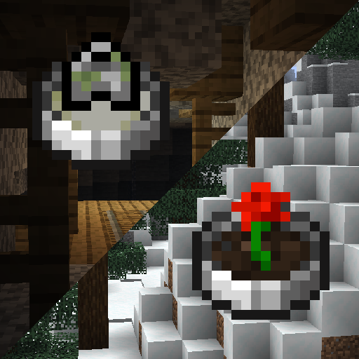
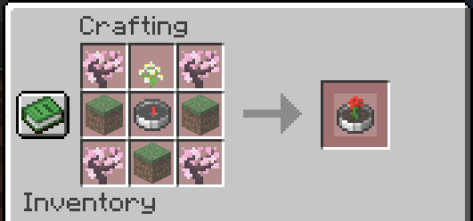
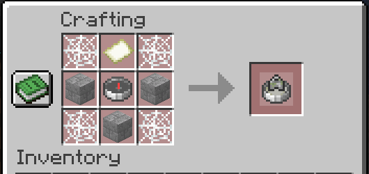
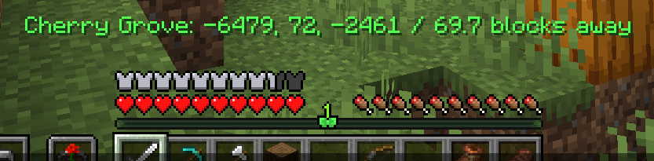

# Navigation Compasses

> [!WARNING]
> This mod can cause extreme lag due to the nature of structure/biome location. This may be remedied in the future with async location but for now, be careful! 

## Usage

### For server owners

You can install the mod with Fabric API and it will work as intended. However, for the best experience I recommend you install [Polymer](https://modrinth.com/mod/polymer) and set up [resource pack hosting](https://polymer.pb4.eu/latest/user/resource-pack-hosting/).

There is a configuration file at `config/navigation-compasses.json` which lets you disable the compass items (ex. if you are running Terra you might want to disable biome locators due to the lag it causes), modify the search range (which will reduce the length lag spikes), and the search cooldown (in ticks, will probably reduce number of lag spikes).

It should work with any other structure/biome mods, though some may cause lag while locating depending on rarity.

Floodgate (Bedrock) players have special GUI handling, so it'll work great with them. (If you are concerned about item textures, you can try the ***heavily beta not-complete could-break no-warranty*** compatibility mod [Bedframe](https://github.com/sylvxa/bedframe), which adds Polymer textures to Geyser)

### For players

The **Biome Locator** does what it says on the tin, it opens a menu containing every biome and lets you select one to locate.

*The saplings can be any kind of sapling, the dirt can be any dirt-like block, and the flower can be any short flower.*

The **Structure Locator** works the same way but for structures.

The locators add a locator bar waypoint and action bar message to help assist with navigation.

*These elements are faked through some packet trickery and are only visible to the player locating.*